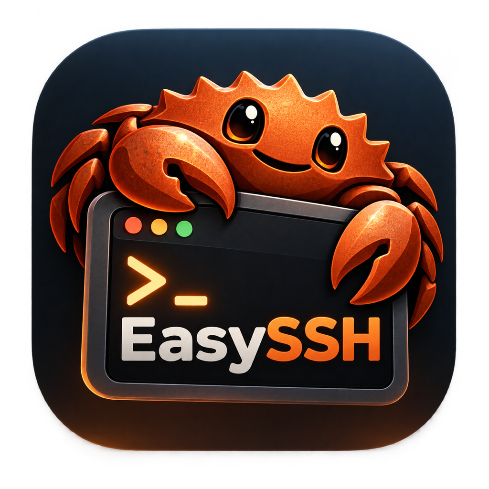

<div align="center">



# easySSH

### SSH, minus the fiddly bits.

**Type your password once. Never type it again.**

easySSH sets up key-based login for you, opens a real terminal that's already
connected, and brings your server's web apps straight into your browser —
all from one friendly window.

[](../../releases/latest)


[](LICENSE)

[**Download**](../../releases/latest) ·
[Quick start](#quick-start) ·
[What it does](#what-easyssh-does-for-you) ·
[FAQ](#questions-people-ask) ·
[Build it yourself](#building-from-source)

</div>

---

## Welcome

Got a new server? Normally that's the start of a small ritual:
`ssh-keygen`, `ssh-copy-id`, hoping the permissions are right, editing
`~/.ssh/config`, trying to remember which port that dashboard was on, and typing
`ssh -L 8080:localhost:3000 …` every single time.

**easySSH does all of that for you.** You don't need to know what any of those
commands mean — and if you do, you'll find easySSH still speaks plain OpenSSH
underneath, so nothing it sets up locks you in.

| Instead of… | …you just |
| --- | --- |
| `ssh-keygen` + `ssh-copy-id` + fixing `authorized_keys` permissions | type your password once and click **Set Up** |
| `ssh -L 8080:localhost:3000 user@host` and remembering ports | flip a switch and click **Open** |
| editing `~/.ssh/config` by hand | click **Add to Config** |
| `vim ~/.ssh/known_hosts` after a server rebuild | select the entry and click **Remove** |
| `chmod 600 aws-key.pem` and `ssh -i … ec2-user@…` | **Browse…** to the `.pem` and click **Connect** |
| `chmod 600 ~/.ssh/that-key` after ssh refuses it | nothing — easySSH spots it and fixes it |

---

## Quick start

### 1. Install it

Grab the installer for your computer from the
[**latest release**](../../releases/latest):

| Your computer | Download |
| --- | --- |
| Mac with Apple Silicon (M1 and later) | `easySSH_x.y.z_aarch64.dmg` |
| Mac with an Intel chip | `easySSH_x.y.z_x64.dmg` |
| Windows | `easySSH_x.y.z_x64-setup.exe` (or the `.msi`) |
| Debian or Ubuntu | `easySSH_x.y.z_amd64.deb` |

Prefer to compile it? You can [build it yourself](#building-from-source)
in one command.

> **First launch on a Mac.** easySSH isn't signed with a paid Apple
> certificate, so macOS asks you to confirm the first time. Open
> **System Settings → Privacy & Security**, scroll down to the note about
> easySSH, and click **Open Anyway**. (On older macOS, right-click the app and
> choose **Open**.) You only need to do this once.
>
> If macOS says easySSH *"is damaged and can't be opened"*, you have a
> release from **v1.5.3 or earlier**, which shipped with an incomplete
> signature. Grab a newer release, or clear the download flag yourself:
>
> ```sh
> xattr -dr com.apple.quarantine /Applications/easySSH.app
> ```

### 2. Say hello to your servers

If you already have a `~/.ssh/config`, every server in it is waiting in the
sidebar the moment you open the app, tagged `cfg`. There's nothing to import.
Starting fresh? Click **New Connection** and fill in the host, user and port.

### 3. Set up passwordless login

Select a connection and click **Set Up…** under *Authentication*.

**First, easySSH checks whether you even need to.** If a key on your computer
already gets you in — maybe you set that server up by hand years ago — easySSH
notices, switches the connection over to that key, and tells you there's
nothing left to do. No password asked for. It also keeps an eye out in the
background, so a connection often shows up as ready before you've clicked
anything.

Otherwise, enter your password one time and easySSH will:

- create an Ed25519 key if you don't have one (or use the key you pick),
- add the public key to `~/.ssh/authorized_keys` on the server,
- fix the folder and file permissions, and the SELinux label if there is one,
- **log in again with the key to prove it really worked.**

That last step is the important one. If the server has key login switched off,
or its home folder is read-only, you find out straight away — not next week
when you're in a hurry.

### 4. Connect and get to work

Click **Connect**, and from there:

- **Terminal** — opens iTerm or Terminal.app (macOS), Windows Terminal, or
  your usual terminal on Debian/Ubuntu, already logged in. Your shell, your
  colours, your scrollback, your tmux.
- **Web tunnels** — add one, flip it on, click **Open**, and the server's
  dashboard appears in your browser as if it were running on your own machine.
- **Files** — send a file or a whole folder to the server, fetch one back, or
  share one with programs on the server through a simple link.
- **Run a command** — a quick one-off without leaving the app, with the
  output, errors and exit status shown.

That's it. You're done.

---

## What easySSH does for you

### Shows you everything at a glance

Every connection has a row of little status lights, in the sidebar and on its
page. easySSH keeps them up to date quietly in the background, so you can see
how all your servers are doing without clicking into any of them.

| Light | Green | Blue | Yellow | Red | Grey |
| --- | --- | --- | --- | --- | --- |
| **Session** | connected | — | dropped, being rebuilt | — | not connected |
| **Reachable** | — | the server answers | — | no answer | not checked yet |
| **Key login** | logs in without a password | — | — | the key was refused | unknown |
| **Tunnels** | at least one is up | — | — | all down, or **blinking** on an error | no tunnels yet |
| **Restore** | tunnels never dropped | — | dropped and put back | couldn't be put back | not connected |

### Opens your server's web apps in your browser

A web tunnel connects a port on your computer to an address that **your
server** can reach:

```
127.0.0.1:8080   →   localhost:3000     the server's own web app
127.0.0.1:8081   →   10.0.0.9:8443      a machine on the server's private network
127.0.0.1:5433   →   db.internal:5432   anything the server can look up
```

Because the address is looked up *on the server*, you can reach services that
only listen on the server itself, or machines your laptop has no route to at
all.

Mark a tunnel **auto-start** and it comes up as soon as you connect. Add or
edit one while you're already connected and it starts right away. The switch
beside each tunnel turns it on and off whenever you like.

### Moves files and folders both ways

Open the **Files** card on a connected server and pick what you want to do.
You can collapse the card when you don't need it, and easySSH remembers that.

- **Send.** Choose a file or a folder on your computer, choose where it should
  go on the server (type a path like `~/uploads`, or click **Browse…** to walk
  the server's folders), and click **Send**. Missing folders are created on the
  way.
- **Fetch.** Type or browse to a file or folder on the server, choose where to
  save it on your computer (your Downloads folder unless you pick another), and
  click **Fetch**.

Folders are compressed into a single stream for the trip and unpacked on
arrival, so a folder of ten thousand small files moves as one transfer, not ten
thousand. Permissions and timestamps come along too. A progress bar shows how
far along it is. The server needs nothing beyond the `tar` command that every
Linux and macOS machine already has.

Anything with the same name at the destination is replaced. Archives coming
back from a server are unpacked safely: nothing in them can write outside the
folder you chose.

### Shares a file with the server through a link

Sometimes a program on the server, such as an AI agent, a build script or a
notebook, needs something that's on your computer. Choose **Share by Link**,
pick a file or folder, and easySSH gives you a URL like this:

```
http://127.0.0.1:41817/9f3c2a7be41d06c58a1f77e2d9b0c4a1/dataset
```

Anything running *on the server* can fetch it with `curl`, `wget` or any HTTP
client, and easySSH shows a ready-to-paste command. For a folder, the URL
returns a list of its files, each of which can be fetched on its own, and
`<name>.tar.gz` fetches the whole folder in one go.

It's designed to be safe to leave on:

- **Nothing opens on your computer or your network.** easySSH asks the server
  to listen on its own `127.0.0.1` and send each request back through the SSH
  connection you already have (the same mechanism as `ssh -R`). That also
  means it works from behind home routers and office firewalls.
- **Only programs on the server can reach it**, and only with the link.
- **The link changes every 15 minutes.** Each link carries a random token that
  expires after 15 minutes. easySSH always shows the current one, with a
  countdown, so a link pasted somewhere stops working on its own. **New Link**
  replaces it straight away.
- **One share per connection.** Choosing something new replaces the old share.
  The switch turns the link off and on without forgetting what you chose, and
  **Stop Sharing** ends it completely. Disconnecting ends it too.
- **Only what you shared is reachable.** Requests can't climb out of a shared
  folder, including through symbolic links inside it.

If the connection drops and easySSH rebuilds it, the share comes back with it,
on the same address whenever the server allows.

### Puts tunnels back when the connection drops

Laptops sleep, Wi-Fi changes, VPNs drop, servers restart. When that happens to
an ordinary SSH tunnel, the port on your computer keeps accepting connections
while nothing gets through, so everything *looks* fine and your browser just
hangs.

easySSH checks every 20 seconds that each connection can really carry traffic.
When one can't, it reconnects and brings your tunnels back on the same ports,
so you just reload the page. The **Restore** light beside each tunnel tells you
what's happened since you connected:

| | |
| --- | --- |
| **Green** | it has never dropped |
| **Yellow** | it dropped and easySSH put it back (the count shows how often) |
| **Red** | it dropped and easySSH couldn't put it back |

Yellow means everything works. It's there so that a connection that keeps
dropping stands out from one that never has. **Check Now** on the Web tunnels
card runs the check straight away, and a checkbox underneath turns automatic
restoring off if you'd rather manage it yourself.

### Works with the ssh config you already have

easySSH respects your setup and keeps its own things separate:

- **`~/.ssh/config` is yours.** easySSH reads it and never changes it, apart
  from adding a single `Include ez_config` line at the top.
- **`~/.ssh/ez_config` is easySSH's**, in the same folder and the same OpenSSH
  format, with `IdentityFile` and `LocalForward` lines filled in. So every
  connection you save in easySSH also works as plain `ssh <name>` from any
  terminal. The few things ssh config can't hold (colours, tunnel names) live
  beside it in `ez_config.json`.

A few things you'll notice:

- **Edits appear live.** Add or remove a `Host` in your editor and it shows up
  or disappears within a couple of seconds, with no restart.
- **Delete a `Host` and it's gone** from easySSH too.
- **Import to make it yours.** Click **Import** on a `cfg` connection (or just
  edit it, or give it a tunnel) and easySSH looks after it from then on. Your
  config file keeps its `Host` block exactly as it was.
- **Pick a config.** The picker at the bottom of the sidebar lists every
  `.ssh` folder easySSH found, with how many keys and hosts each has. Your
  choice is remembered.
- **Hide config hosts** by unticking *Show hosts from this config*, if you'd
  rather see only the connections easySSH owns.
- **Add to Config** writes a `Host` block for a connection, so `ssh myserver`
  works from any terminal afterwards. Existing blocks are never rewritten.

| Platform | Where easySSH looks |
| --- | --- |
| macOS / Linux | `~/.ssh`, `/etc/ssh` |
| Windows | `~/.ssh`, `%USERPROFILE%\.ssh`, `%ProgramData%\ssh`, Git for Windows' `etc\ssh` |

Set `EASYSSH_SSH_DIR` to put a folder of your own at the top of the list.

### Takes care of your keys

Pick a key from your `.ssh` folder, browse to one anywhere, or create a new
Ed25519 or RSA pair. New keys are saved so only you can read them (`0600` on
Mac and Linux, with the equivalent locked-down permissions on Windows). You can
view or copy any public key from the key icon in the sidebar.

**Browse… works out what you picked**, so you don't have to:

- It reads the key formats `ssh-keygen` writes, plus PEM (what AWS gives you)
  and PuTTY's `.ppk`.
- Picked the `.pub` half by mistake? It finds the private key beside it.
- Permissions too open for `ssh`? It tightens them. If the key lives
  somewhere like your Downloads folder, it copies it into `.ssh` safely
  instead.
- No `.pub` file? It makes one, so the key can be installed on other servers.

**It keeps an eye on keys later, too.** Keys dragged in from Finder, restored
from a backup or copied off another machine keep whatever permissions they
had. Those keys would work inside easySSH but then fail in the terminal with a
scary *"UNPROTECTED PRIVATE KEY FILE!"* warning. So easySSH marks any key `ssh`
would refuse, offers **Fix permissions** beside it, and quietly tightens a key
before using it, telling you what it did. You shouldn't ever need `chmod`.

### Makes known_hosts painless

The shield icon opens a friendly editor for `known_hosts`. For each entry it
shows the host, the key type, the fingerprint, and which of your connections
rely on it. Reach for it when a server has been rebuilt and easySSH refuses to
connect because its host key changed. The file is backed up before every edit,
and easySSH won't remove anything if the file changed since you opened it.

### Makes AWS EC2 simple

An EC2 server has no password login at all: AWS hands you a `.pem` key once,
and the terminal refuses it because of its permissions. With easySSH you just
**Browse…** to that file. easySSH copies it into your `.ssh` folder with the
right permissions and creates the matching public key.

Type an EC2 address into **New Connection** and easySSH switches to key login
and fills in `ec2-user`. The right user name depends on the server's operating
system, so here's a handy table:

| Operating system | User |
| --- | --- |
| Amazon Linux | `ec2-user` |
| Ubuntu | `ubuntu` |
| Debian | `admin` |
| CentOS / Rocky / Fedora | `centos`, `rocky`, `fedora` |
| Bitnami | `bitnami` |

There's no **Set Up…** step, because AWS already installed your key. Connect,
and everything else works as usual.

---

## How easySSH looks after your credentials

- **Passwords are never written to disk.** easySSH keeps one in memory only
  while it needs it: for a key install, or for the life of an open connection
  so it can reconnect after a drop. It's gone the moment you disconnect.
  `ez_config` has no place for one.
- **Server identities are checked.** The first time you connect, easySSH
  records the server's host key and shows you its fingerprint. If that key ever
  *changes*, easySSH refuses to connect, because that's what an impersonation
  attack looks like.
- **Nothing happens behind your back with a new server.** Background checks and
  automatic reconnects only ever *log in* to servers already in your
  `known_hosts`, so a key or password is never offered to a machine you haven't
  seen.
- **Gentle on your servers.** Background key checks use a single connection,
  offer at most five keys (under OpenSSH's default limit of six attempts), and
  wait longer and longer after a refusal, up to an hour. So easySSH never looks
  like an attack to tools such as fail2ban.
- **Shared links stay on the server.** A file you share by link is reachable
  only from the server's own `127.0.0.1`, through your SSH connection, with a
  token that expires every 15 minutes. Nothing listens on your computer.
- **Only your own tunnels open in your browser.** The Open button only accepts
  `127.0.0.1` addresses.
- **The real `ssh` runs your terminal.** easySSH hands your terminal an `ssh`
  command and never sits in the middle of your interactive session.

Your connections live in `ez_config` in your `.ssh` folder, readable only by
you, like everything else there. The only other thing easySSH saves is its app
settings (such as which `.ssh` folder you've chosen), in
`~/Library/Application Support/easySSH/` on macOS, `%APPDATA%\easySSH\` on
Windows and `~/.config/easySSH/` on Linux.

---

## Questions people ask

<details>
<summary><b>Do I need to know how SSH works to use this?</b></summary>

Not at all. If you have a server address, a user name and a password, easySSH
handles the rest. If you *are* an SSH expert, everything it creates is plain
OpenSSH config and keys, so your usual tools keep working.
</details>

<details>
<summary><b>Will it mess with my existing <code>~/.ssh/config</code>?</b></summary>

No. It reads your config and only ever adds one `Include ez_config` line at the
top. Everything easySSH writes goes into its own `ez_config` file beside it.
</details>

<details>
<summary><b>I already use key login on my server. Do I have to set anything up?</b></summary>

No. easySSH tries the keys already on your computer and, if one works, switches
the connection to it and marks it as set up. You'll see a little note saying so.
</details>

<details>
<summary><b>My web page stopped loading after my laptop slept. What do I do?</b></summary>

Usually nothing. easySSH notices within about 20 seconds and rebuilds the
tunnel, and the tunnel's light turns yellow to show it happened. Reload the
page. If you're in a hurry, click **Check Now** on the Web tunnels card.
</details>

<details>
<summary><b>easySSH says the host key changed and won't connect.</b></summary>

That's easySSH protecting you. If you know the server was rebuilt or
reinstalled, open the shield icon, remove the old entry for that server, and
connect again. If you *don't* know why it changed, check with whoever runs the
server first.
</details>

<details>
<summary><b>How do I give an AI agent on my server a file from my laptop?</b></summary>

Connect, open **Files → Share by Link**, and pick the file or folder. Copy the
URL (or the ready-made `curl` command) and hand it to the agent. It fetches the
file straight from your laptop through the SSH connection. The link expires
after 15 minutes, and easySSH always shows the current one.
</details>

<details>
<summary><b>Can I send a whole folder?</b></summary>

Yes. Choose **Folder…** instead of **File…**. easySSH compresses it for the
trip and unpacks it on the other side, both when sending and when fetching.
</details>

<details>
<summary><b>Does it work with a password-protected (passphrase) key?</b></summary>

Yes. easySSH asks for the passphrase when you connect. Background checks skip
such keys, because they can't type a passphrase for you.
</details>

---

## Building from source

All you need is [Rust](https://rustup.rs). The build scripts install
everything else.

```bash
git clone https://github.com/leondavi/easySSH.git
cd easySSH

./scripts/build.sh              # installers for the computer you're on
./scripts/build.sh macos        # .dmg + .app
./scripts/build.sh linux        # .deb, on Debian or Ubuntu
./scripts/build.sh --universal  # one .dmg for both Apple Silicon and Intel
```

On Debian or Ubuntu, the app draws its window with the system's WebKitGTK, so a
few development packages are needed first:

```bash
sudo apt-get install -y libwebkit2gtk-4.1-dev libgtk-3-dev librsvg2-dev \
  libssl-dev libayatana-appindicator3-dev patchelf build-essential
```

(`build.sh linux` checks for these and tells you exactly which are missing.)

On Windows, in PowerShell:

```powershell
.\scripts\build.ps1             # .exe (NSIS) + .msi
.\scripts\build.ps1 -Bundles nsis
```

The installers end up in `src-tauri/target/release/bundle/`.

**Each platform's installers have to be built on that platform.** The easiest
way to get all of them at once is to push a version tag:
`.github/workflows/release.yml` then builds macOS (both chip types), Windows
and Debian/Ubuntu and gathers them into a draft release. The `.deb` is built on
Ubuntu 22.04 so that it installs on every supported release.

For development with live reload:

```bash
cargo tauri dev
```

### Signing

`build.sh` signs the `.app` well enough to run on the machine that built it.
To ship to other people without the first-launch prompt, you need an Apple
Developer ID and notarisation. Set `APPLE_SIGNING_IDENTITY`, `APPLE_ID`,
`APPLE_PASSWORD` and `APPLE_TEAM_ID`, or add them as repository secrets for the
release workflow.

---

## Contributing

Contributions, bug reports and ideas are very welcome. Please
[open an issue](../../issues) or send a pull request.

```bash
cd src-tauri
cargo test           # 109 tests, including a real SSH server harness
cargo clippy --all-targets -- -D warnings
cargo fmt
```

CI runs the tests on macOS, Windows and Ubuntu, checks the UI wiring, and
**builds the Windows installers and the Linux `.deb` on every push**. Those
platforms' code can't be compiled on a Mac, so CI is what proves it works.

The tests don't just read the code, they run it. `testserver.rs` is a real SSH
server, so the tests genuinely log in with passwords and keys, forward ports
end to end, run the `authorized_keys` script under a real shell, send and fetch
folders through a real `tar`, fetch a shared link back through a reverse
forward, and cut or silence a live connection to prove that tunnels come back.

<details>
<summary><b>Project layout</b></summary>

```
src-tauri/src/
  main.rs        window setup, command registration, background checks
  commands.rs    the API the UI calls
  ssh.rs         connecting, key discovery, running commands, installing keys
  tunnels.rs     local port forwarding
  restore.rs     watching live tunnels and rebuilding the dead ones
  transfer.rs    sending and fetching files and folders
  publish.rs     sharing one file or folder with the server by link
  probe.rs       background reachability and key-login checks
  sshconfig.rs   .ssh discovery and the ssh_config parser
  knownhosts.rs  reading and editing known_hosts
  keys.rs        key discovery, inspection and generation
  terminal.rs    handing an ssh command to the platform's terminal
  ezconfig.rs    the ez_config connection store in ~/.ssh
  store.rs       app settings, and the move off the old profiles.json
  state.rs       live sessions, tunnels, and config-derived connections
  model.rs       types shared with the UI
  testserver.rs  a real SSH server, for tests

ui/              front end: plain HTML, CSS and JS, no build step
scripts/         build.sh (macOS/Linux) and build.ps1 (Windows)
assets/          the easySSH logo
```
</details>

Built with [Tauri 2](https://tauri.app) and
[russh](https://github.com/warp-tech/russh), a pure-Rust SSH implementation, so
there's no OpenSSL or libssh2 to install.

---

<div align="center">


Made with care, in Rust. Released under the [MIT licence](LICENSE).

**Happy connecting!**

</div>
